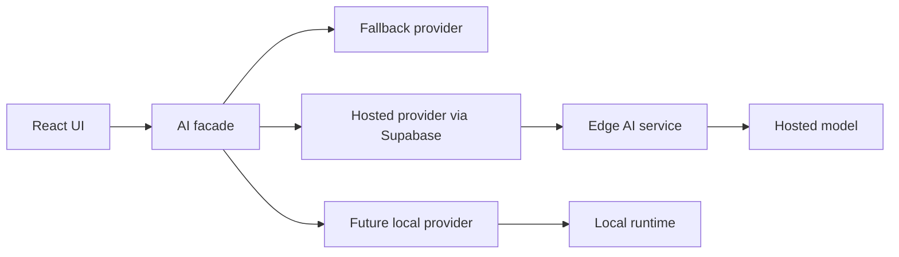

# Local AI Readiness Plan

## Objective

Prepare Engram for local inference without rewriting the product or hard-coupling it to any hosted AI provider.

## Current state

The client calls `src/lib/claude.js`. That file invokes the Supabase `claude-insight` edge function when Supabase is configured and returns local fallback text otherwise.

The edge function at `supabase/functions/claude-insight/index.ts` calls the Anthropic Messages API directly. This works for the current hosted path but is not provider-neutral.

## Provider targets

Engram should support three provider classes behind one contract:

1. **Hosted provider** - current Supabase edge function calling a hosted model.
2. **Local provider** - future local runtime such as Ollama or another localhost service.
3. **Fallback provider** - deterministic local copy and templates when no AI is available.

## Required interface

Every provider should normalize to:

```js
{
  content: string,
  model: string,
  provider: 'hosted' | 'local' | 'fallback',
  cached: boolean
}
```

Every request should define:

```js
{
  task: 'insight' | 'chat' | 'weekly-review',
  context: object,
  history?: Array<{ role: string, content: string }>,
  message?: string
}
```

## Architecture



## Phased rollout

### Phase 1: Contract seam

- Add a provider-neutral response normalizer in the client.
- Keep current `claude-insight` function working.
- Update docs so product language says AI insight, not one vendor.

### Phase 2: Server-side provider module

- Split edge function prompt construction from provider execution.
- Add hosted provider implementation as the first provider.
- Add contract tests for normalized responses.

### Phase 3: Local runtime spike

- Test one local runtime with one weekly-review prompt.
- Measure latency, memory, output quality, and setup burden.
- Do not add product UI until the runtime passes the spike.

### Phase 4: User-selectable provider

- Add provider config only after hosted and local providers share one contract.
- Keep fallback behavior automatic.
- Make local provider optional and clearly marked experimental.

## Runtime constraints

- Browser-only inference is not the first target; it increases bundle and device risk.
- Localhost inference is the likely first target.
- The client must remain usable when local runtime is unavailable.
- Model output must stay bounded for mobile performance.
- No API keys should enter the browser unless the user explicitly configures a local-only path.

## Stop conditions

Defer local AI integration if:

- Setup requires too much manual operator work.
- Latency makes weekly review feel broken.
- Memory pressure hurts normal PWA use.
- Provider code forces product logic to branch by vendor.
