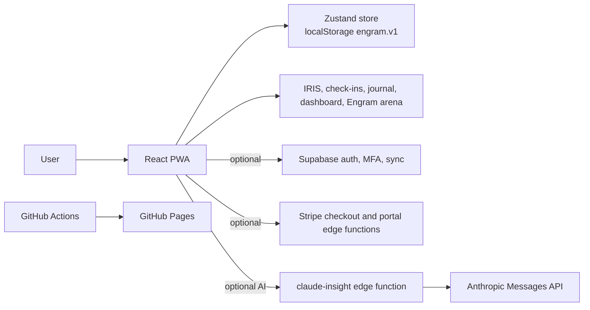

# Project Engram Repo Audit

## Architecture map

Engram is a React 19 and Vite 7 PWA deployed as static files to GitHub Pages. The browser is the primary runtime and Zustand persists canonical user state to `localStorage` under `engram.v1`.

Core paths inspected:

- `src/App.jsx` for routes and app shell.
- `src/lib/store.js` for local-first data shape.
- `src/lib/claude.js` and `supabase/functions/claude-insight/index.ts` for AI integration.
- `src/lib/supabase.js`, `src/lib/auth.jsx`, and `src/lib/stripe.js` for auth and monetization boundaries.
- `src/features/home/Home.jsx`, `src/features/journal/CheckIn.jsx`, and `src/features/insights/*` for the core loop.
- `README.md`, `CLAUDE.md`, `DEV_GUIDE.md`, `IDEAS.md`, and existing docs for process and intent.

## Key strengths

- Local-first posture is real: the app works without Supabase, Stripe, or AI env vars.
- Architecture is simple: static PWA, one store, optional serverless integrations.
- The product loop is visible: IRIS -> check-in/journal -> dashboard patterns -> Engram progression.
- Deploy and CI are straightforward: lint, docs check, tests, build, Pages deploy.
- Existing docs are unusually strong for a young product and support low-token onboarding.
- Revenue plumbing exists but is optional and can be refined without blocking core use.

## Key weaknesses

- AI naming and implementation are provider-specific: `claude-insight`, `MODELS`, and the edge function directly encode Anthropic.
- Local AI readiness is architectural rather than implemented; there is no provider contract yet across client and edge.
- Monetization is broad: Pro exists, but the paid wedge is not sharp enough to sell confidently.
- First-run onboarding still asks users to understand IRIS/Engram before the value is fully framed.
- `localStorage` is enough for v1, but long-term backup, export, encryption, and conflict handling are not settled.
- Some routes use legacy naming in redirects and Stripe return URLs (`/you`) even though Settings replaced that concept.

## Tech debt

- Hardcoded hosted AI endpoint/model in edge code.
- Provider-specific client file name (`claude.js`) used as the app-level AI facade.
- Subscription state can drift between local store and backend without a documented reconciliation flow.
- Store schema has a version field but no real migrations yet.
- README auto-sections are protected, but new strategy docs are not indexed automatically.
- Auth, sync, AI, and billing share Supabase as a boundary; failure modes need clearer separation.

## Naming and branding inconsistencies

- Company/product distinction needs to be explicit: Revenant AI is the company, Engram is the product.
- Product module names should stay stable: Dashboard, IRIS, Check-in, Journal, Insights, Chat, Engram, Arena, Player Card.
- Provider names should not appear in user-facing product framing unless explaining setup.
- `claude-insight` should eventually become a provider-neutral function or route behind an AI service contract.
- Legacy `/you` references should be retired in favor of `/settings` or `/account` when code is touched.

## Monetization blockers

- Engram Pro currently reads like "more AI" rather than one sharp paid outcome.
- Immediate cash flow should come from services adjacent to Engram, not from overloading the unfinished product.
- Checkout exists, but entitlement boundaries and subscription refresh behavior need stronger tests.
- The product needs one concise buyer promise before paid conversion surfaces are expanded.
- Play Store/TWA billing constraints remain a blocker for in-app purchases through mobile distribution.

## Local-AI readiness assessment

Status: partially ready.

Ready:

- Local-first data model.
- Offline-capable PWA shell.
- Optional AI path with graceful fallback.
- Edge-function boundary that can later hide provider routing.

Not ready:

- Provider interface shared by client and edge.
- Capability model for hosted, local, and fallback providers.
- Local runtime constraints and latency budget.
- Tests that prove provider responses normalize to one app contract.
- UI language that separates "AI insight" from one hosted vendor.

## Top 10 highest-leverage next moves

1. Add a provider-neutral AI response contract and use it from `src/lib/claude.js`.
2. Document local AI architecture before integrating a local runtime.
3. Rename or wrap provider-specific AI paths behind an Engram AI service boundary.
4. Polish first-run onboarding around one sentence: "Engram learns you through daily signal."
5. Clarify Engram Pro as a paid weekly review / private intelligence wedge, not generic unlimited AI.
6. Create service offers for Revenant AI to generate cash flow before product subscription pressure.
7. Add tests around subscription entitlement and AI fallback behavior.
8. Plan export/backup before the local store becomes too complex.
9. Retire `/you` naming as touched and align account/settings flows.
10. Keep LangGraphJS out until there is a real durable orchestration problem.
